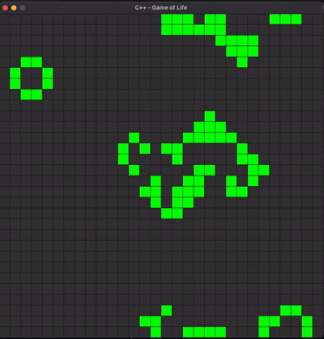

# conway-gol
Conway's Game of Life in Raylib

---

This is a simple Game of Life Implementation using the Raylib graphics library.
It is mainly a way for me to practice some C++ and explore cellular automata a bit
since I think they are pretty cool.

# Game of Life Rules

1. A live cell with fewer than two live neighbor cells dies.
2. A live cell with two or three live neighbors lives to the next generation.
3. A live cell with more than three live neighbors dies.
4. A dead cell with exaclty three neighbors becomes a live cell.